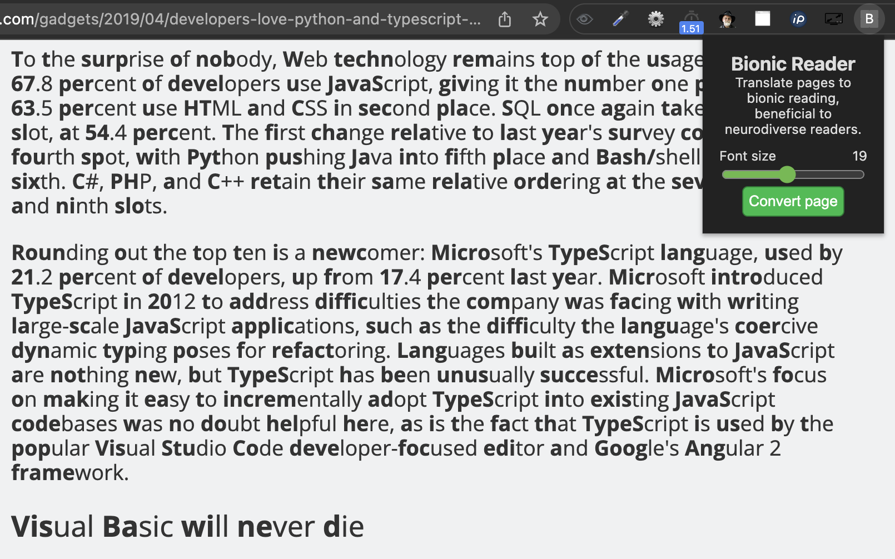

# Bionic reader
A Chrome extension for translating pages to bionic reading, which can be very beneficial to neurodiverse readers. [Read more about Bionic Reading here.](https://bionic-reading.com/)

## Features

- Bionic reading on any webpage with a click on a button;
- Configurable font size;
- Fixed font for easy reading.

## Example screenshot

## Font

It overrides the font of the webpage as many (many) fonts don't work with Bionic Reading. This is mainly because of the size of bold and thin letters, and it seems having mono-spaced sans fonts improves neurodiverse reading capabilities anyway.

It currently uses Google's Open Sans, which I want to make configurable once I have the time.
