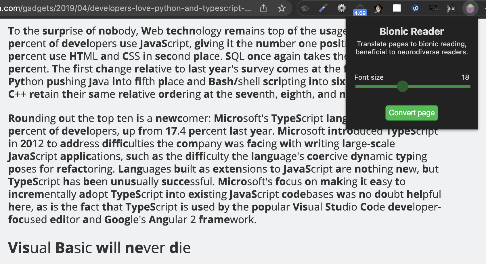

# Bionic reader
A Chrome extension for translating pages to bionic reading, which can be very beneficial to neurodiverse readers.

[Check it out in the Chrome Web Store.](https://chrome.google.com/webstore/detail/bionic-reader/afofodfmpeikmcpjoobibhipehodefjc?hl=en&authuser=0)

[Read more about Bionic Reading here.](https://bionic-reading.com/)

## Features

- Bionic reading on any webpage with a click on a button;
- Keeps links and highlighting intact;
- Configurable font & font size;
- Automated tests.

## Example screenshot



## Font
It overrides the font of the webpage as many (many) fonts don't work with Bionic Reading. This is mainly because of the size of bold and thin letters, and it seems having mono-spaced sans fonts improves neurodiverse reading capabilities anyway.

The font is configurable, you can choose one of these fonts:
- Open Sans
- Noto Sans
- Source Sans Pro

## How to install
[Check it out in the Chrome Web Store!](https://chrome.google.com/webstore/detail/bionic-reader/afofodfmpeikmcpjoobibhipehodefjc?hl=en&authuser=0)

Or, you can add it with these steps:

- Download the repo (git clone, or as a zip and unpack)
- Go to `Settings`, and then `Extensions`
- Enable `Developer mode` on the right top side
- Press the `Load unpackaged` button on the left top side
- Select the directory with the repository


## Development
Automated tests are set up using `Jest`, so to collaborate you'll need to install `node`.

Run tests:
```bash
npm test
```

Build new artifact:
```bash
npm run build
```
